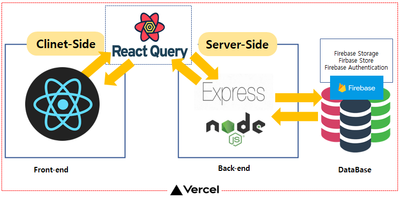

# DAECHWITA

## Intro

개인의 자기소개서 관리 플랫폼, 취업 준비할 때, 많은 취준생들이 적게는 수 십장 많이는 수 백장의 입사지원을 하게 됩니다. 또한, 매번 자기소개서를 쓰다보면 비슷한 내용의 자기소개서를 관리하지 않아 새롭게 써야할 상황이 벌어지기도 합니다. 이때, 개인의 자기소개서를 관리해주고, 개인의 지원현황을 관리하는 플랫폼이 있으면 좋겠다는 생각으로 이 프로젝트를 진행하게 되었습니다.

## Open Graph Image


## 주요 기능

- **자기소개서 관리하기** : 개인의 자기소개서를 작성할 수 있습니다. 작성할 때, `임시저장` 버튼을 통해 작성 도중에 저장을 하고, `확인`버튼을 통해 출간을 할 수 있습니다. 또한, 기업의 로고 이미지를 첨부할 수 있습니다.
- **자기소개서 목록** : 작성한 자기소개서의 목록을 볼 수 있습니다. 첨부한 `이미지`와 `테그` (ex. 장단점, 자기소개, 지원동기 등) 이 카드에 보여지도록 합니다.
- **자기소개서 검색** : 작성한 자기소개서를 검색하여 원하는 자기소개서를 찾을 수 있습니다.
- **입사 지원 현황** : `서류전형`, `면접전형(1차)`, `면접전형(2차)` , `최종합격` 등의 `Drag & Drop` 으로 나의 입사 지원 현황을 관리할 수 있습니다.
- **데이터 분석** : 지원한 입사지원현황과 자기소개서를 분석하여 가장 많이 쓴 자소서 유형과 지원한 직무 등을 `차트`로 볼 수 있습니다.
- **그 밖의 기능** : 면접페이지에서는 면접을 대비하기 위해 면접 질문을 입력하면 TTS를 통해 음성이 출력됩니다.
- 6월까지 면접의 기능에 대해 면접 리스트를 보관하고, 미리 입력하면 시간대별 선택을 통해 출력 되도록 구현할 에정입니다.

## 🔎 프로젝트 살펴보기

### 프로젝트 실행

프로젝트의 `client`, `server` 디렉토리에서 아래 커맨드를 각각 실행
(단, Firebase는 개인의 SDK를 사용하여야 합니다. )

```shell
npm install
npm run start
```

### 주요 기술

- **React.js** : 웹 UI 라이브러리
- **React-Query** : Server 상태 관리
- **React-Dnd** : 입사 지원 현황의 데이터를 Drag & Drop을 위해 사용
- **Firebase** : 데이터 베이스를 위해 Storage, auth를 사용
- **TypeScript** : 정적 타입 사용 및 코드 에러 검출
- **Axios** : HTTP 비동기 통신을 위하여 사용
- **Emotion** : 초기 로드 속도를 높이고 커스텀 스타일을 적용하기 위해 사용
- **apexcharts** : 보여질 데이터의 시각화를 위해 사용 (Treemap, bar, donut 차트 등 사용)

### 🔗 Link

- [웹 사이트](https://daechwita-v8od.vercel.app/)
- [API 명세서](https://github.com/ohtaekwon/daechwita/wiki)
- 프로젝트 정리 및 후기

### 🛠 Architecture


